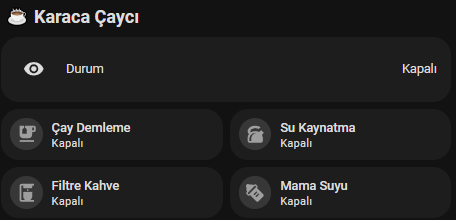
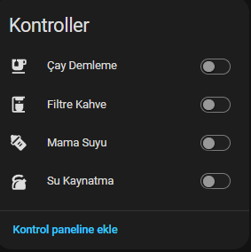
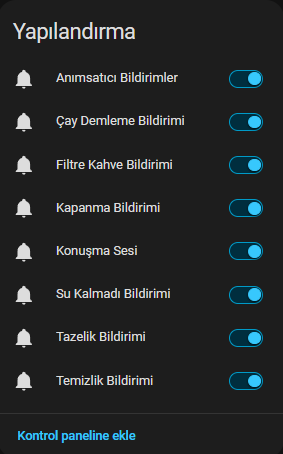
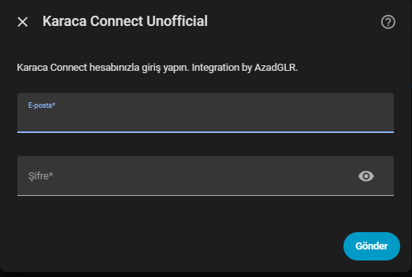

# Karaca Connect Unofficial

Karaca Connect cihazları için resmi olmayan Home Assistant entegrasyonu.
> Bu proje Karaca ile bağlantılı değildir, Karaca tarafından onaylanmamıştır veya desteklenmemektedir.

Unofficial Home Assistant integration for Karaca Connect devices.
> This project is not affiliated with, endorsed by, or supported by Karaca.

---

## 🇹🇷 Türkçe

**Karaca Connect Unofficial**, Karaca Connect uygulamasıyla çalışan uyumlu cihazları Home Assistant üzerinden kontrol etmek için geliştirilmiş resmi olmayan bir Home Assistant entegrasyonudur.

### Özellikler

- Çay Demleme
- Su Kaynatma
- Filtre Kahve
- Mama Suyu
- Türkçe durum sensörü
- Otomatik cihaz keşfi
- Bildirim ve konuşma sesi ayarları
- Home Assistant cihaz sayfasında temiz kontrol görünümü

### Test Edilen Cihaz

- Karaca Çaysever Robotea Pro Connect 4in1
- Device type: `robotea4in1`

---

## 🇬🇧 English

**Karaca Connect Unofficial** is an unofficial Home Assistant integration for compatible Karaca Connect devices.

### Features

- Tea Brewing
- Boiling Water
- Filter Coffee
- Baby Water
- Turkish status sensor
- Automatic device discovery
- Notification and voice settings
- Clean Home Assistant device page controls

### Tested Device

- Karaca Çaysever Robotea Pro Connect 4in1
- Device type: `robotea4in1`

---

## 📸 Screenshots / Ekran Görüntüleri

### Dashboard



### Device Page / Cihaz Sayfası



### Configuration / Yapılandırma



### Setup Flow / Kurulum Ekranı



---

## 📦 Installation / Kurulum

Bu entegrasyon şu anda özel/ücretli olarak dağıtılmaktadır.
This integration is currently distributed as private paid software.

### Manual Installation / Manuel Kurulum

[](https://my.home-assistant.io/redirect/hacs_repository/?owner=Azadglr&repository=ha-karaca-connect-unofficial&category=integration)

1. Extract the ZIP file.  
   ZIP dosyasını açın.

2. Copy the `karaca_connect` folder into:   /config/custom_components/

3. Restart Home Assistant.

4. Go to:   Settings → Devices & Services → Add Integration

5. Search for:   Karaca Connect Unofficial

6. Enter your Karaca Connect account information.

7. Select your device if multiple devices are found.

---

## 🎛️ Controls / Kontroller

After installation, the device page shows four main switches:

Kurulumdan sonra cihaz sayfasında dört ana switch görünür:

- Çay Demleme / Tea Brewing
- Su Kaynatma / Boiling Water
- Filtre Kahve / Filter Coffee
- Mama Suyu / Baby Water


---

## ⚙️ Configuration / Yapılandırma

Bildirim ve konuşma sesi ayarları cihazın **Yapılandırma** bölümünde görünür.
Notification and voice settings are shown under the device **Configuration** section.

Available settings:

- Çay Demleme Bildirimi
- Filtre Kahve Bildirimi
- Tazelik Bildirimi
- Kapanma Bildirimi
- Su Kalmadı Bildirimi
- Anımsatıcı Bildirimler
- Konuşma Sesi
- Temizlik Bildirimi

---

## ❤️ Support / Destek

Bu proje işinize yarıyorsa geliştirmeyi destekleyebilirsiniz.

If this project is useful for you, you can support development.

- GitHub Sponsors: `coming soon`
- Buy Me a Coffee: `coming soon`
- Shopier / Payment Link: `coming soon`
- Contact: `azadgulerr@gmail.com`

---

## 🔖 Version / Sürüm

```text
1.0.0
```

---

## 🔒 License / Lisans

Bu yazılım özel/ücretli yazılımdır.
İzinsiz kopyalanamaz, dağıtılamaz, satılamaz, yayınlanamaz, değiştirilemez veya paylaşılamaz.

This software is private paid software.
It may not be copied, redistributed, resold, published, modified, or shared without permission.


See:

```text
PRIVATE_LICENSE.md
```

---

## ⚠️ Disclaimer / Uyarı

Bu proje Karaca ile bağlantılı değildir.
Karaca tarafından geliştirilmemiş, desteklenmemiş veya onaylanmamıştır.
Karaca Connect bulut API’si değişirse entegrasyonun çalışması etkilenebilir.
Kullanım sorumluluğu kullanıcıya aittir.

This project is not affiliated with Karaca.
It is not developed, supported, or endorsed by Karaca.
If the Karaca Connect cloud API changes, this integration may stop working or require updates.
Use at your own risk.